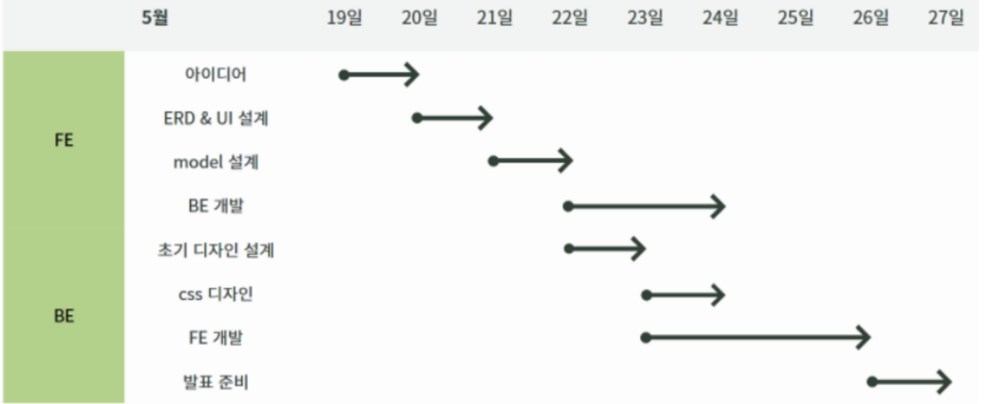
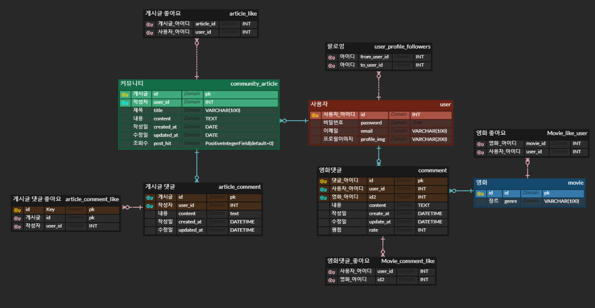
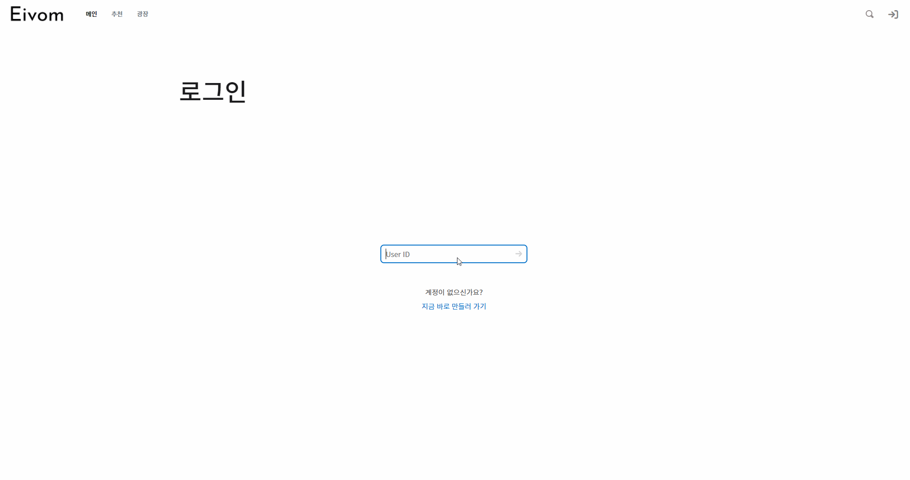
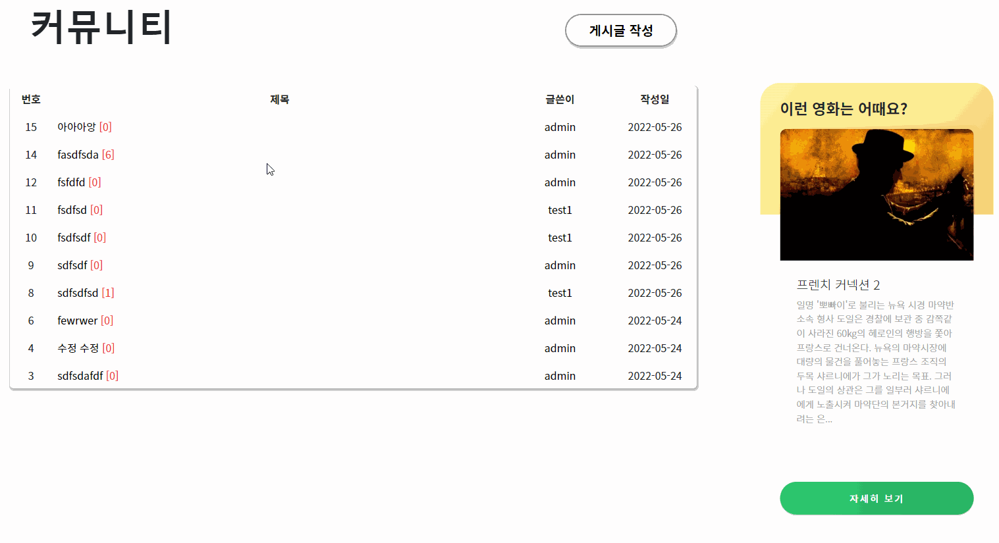

🥇 삼성청년SW아카데미 1학기 관통 프로젝트 우수상🥇

# Project Eivom

# 목차

---

* [프로젝트 소개](#프로젝트-소개)
* [프로젝트 명세](#프로젝트-명세)
  * [프로젝트 기간](#프로젝트-기간)
  * [기술 스택](#기술-스택)
  * [개발 일정](#개발-일정)
  * [ERD](#ERD)
  * [UI 프로토타입](#UI-프로토타입)
* [주요 기능](#주요-기능)
  * [main](#main)
  * [accounts](#accounts)
  * [profile](#profile)
  * [movies](#movies)
  * [articles](#articles)

---

## 프로젝트 소개

> 몇가지 질문만으로 당신이 원하는 영화를 찾아드립니다.
>
> 깔끔한 디자인 속에 다른 사람과 소통을 나눠보세요!

|  |  |
| :----------------------------------------------------------: | :----------------------------------------------------------: |
|            [윤형준](https://github.com/hanggeee)             |            [허재영](https://github.com/DasisCore)            |
| __프로젝트 매니징__ - 일정 관리 - 프로젝트 일정 조율 - 리스크 관리 | __프로젝트 매니징__ - 협업 도구 및 컨벤션 관리 - git 전략 수집 - 일정 관리 |
| __백엔드__ -백엔드 총괄 - ERD 설계 - account, 게시판 관련 BE 구현 | __백엔드__ - 기본 백엔드 베이스 구성 - movie data 관련 BE 구현 - REST API |
| __프론트 엔드__ - 프로필 관련 FE 구현 - 기능 구현 -  vuex 데이터 관리 | __프론트 엔드__ - 프론트엔드 총괄 - 페이지 레이아웃 설계 - 디테일 구현 |
| __기획 및 디자인__ - 컨셉 디자인 - 레퍼런스 수집 - 기술 스택 조사 | __기획 및 디자인__ - 컨셉 디자인 - 디자인 총괄 - 디자인 시스템 CSS 정의 |

## 프로젝트 명세

### 프로젝트 기간

- 2022.05.19 ~ 2022.05.26 (총 8일)

### 기술 스택

- ##### Backend

​		 

- ##### Frontend

​		

​		

   

- ##### 그 외

​		  

## 개발일정

### ERD

#### UI 프로토타입

## 주요 기능

### main

#### [메인페이지]

- 메인 페이지인만큼 이목을 끌 수 있는 영화를 선정.
- 기본적으로 네비게이션 바의 항목을 이용해 다른 탭으로 이동 가능
- carousel 등을 이용한 정보 제공

### accounts

#### [로그인 기능]

- 네비게이션 바를 통해 진입
- 서버의 데이터베이스의 정보와 동일해야 로그인 가능
- 로그인 성공 시 메인페이지 이동
- 로그인 실패 시 오류 표시 후 로그인 창으로 이동

### profile

#### [프로필 페이지]

- 해당 유저가 좋아요를 누른 영화 확인 가능.
- 영화 포스터를 통해 해당 영화로 이동 가능.
- 랜덤 배경색을 이용해 단조로움 해결
- 팔로우 / 팔로잉, 찜한 영화, 프로필 사진 업로드 가능

#### [팔로우 기능]

### movies

#### [영화 상세 페이지]

- 해당 영화의 정보, 출연진, 비슷한 영화 정보 제공
- 댓글 기능 제공
- 영화의 평점 기능 제공

### [영화 추천 기능]

- 사용자와의 상호작용을  통한 영화 추천.
- 영화 추천 후 해당 영화로 이동 가능

### articles

#### [게시판 기능]

게시글 작성 / 삭제 / 수정 기능

- 댓글 작성 / 삭제 / 수정 기능
- 게시판 입구에서 해당 게시글의 댓글 수 확인 가능
- 유명한 영화들 중 하나를 오른쪽에 랜덤으로 제공

